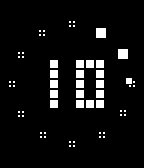
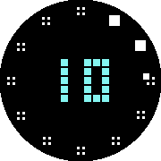
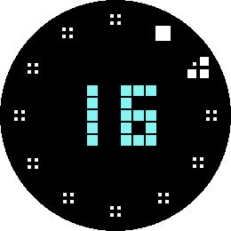
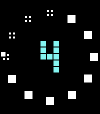
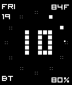
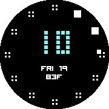
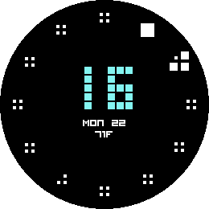
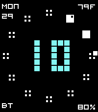

# Pebble Minute Blocks

A Pebble C watchface with twelve five-minute markers around the edge, each
starting as four tiny dots. As the current five-minute block advances, the dots
become square pixels one at a time; when the block is complete, it turns into a
larger box.

The center uses a chunky pixel-style hour readout. Minutes live only in the
outer ring, with small date, weather, battery, and Bluetooth status
complications around the main hour.

The face has per-platform sizing across the Pebble screens: the compact 144×168
watches, the round Pebble Time Round, the larger Pebble Time 2 / `emery`, and the
big round Pebble Round 2 / `gabbro`.

## Screenshots

| Pebble / Pebble 2 | Pebble Time Round | Pebble Round 2 | Pebble Time 2 |
| --- | --- | --- | --- |
|  |  |  |  |
|  |  |  |  |

The complication text uses the Visitor bitmap font by Ænigma, distributed via
DaFont as 100% free. It is bundled at 15, 20, and 25 px sizes so the small
status labels and numbers stay crisp on low-resolution Pebble screens.

## Build

The Pebble SDK needs its bundled ARM toolchain, so the included `justfile`
clears host compiler overrides such as `CC=/opt/homebrew/bin/gcc-15` before
building:

```sh
just build
```

You can still call the Pebble SDK directly if your shell does not override the
C compiler:

```sh
pebble build
```

## Install

For the Pebble Time / Time Steel emulator, use the compact `basalt` target:

```sh
just install --emulator basalt
```

For the Pebble Time 2 emulator, use the larger `emery` target:

```sh
just install --emulator emery
```

For a physical watch through the Pebble/Rebble app developer connection:

```sh
just install --phone PHONE_IP
```

## Settings

The Pebble app settings page supports:

- background color
- minute ring color
- complication color
- center digit color
- color presets, including the default cyan center digits with white ring and
  complications
- time mode: watch setting, 12-hour, or 24-hour
- complication size: normal, medium, or large
- complication visibility: always shown, or hidden until a tap/shake/backlight
- subtle seconds sweep: never, always, or hidden until a tap/shake/backlight
- kinetic animations: blocks fall in, smash together on completion, and cascade
  at the top of the hour (off by default)
- each corner complication: none, date, current temperature, forecast range,
  battery, Bluetooth, or steps
- weather on/off
- weather units: Fahrenheit or Celsius

Weather uses PebbleKit JS on the phone with location permission and Open-Meteo.
It refreshes current temperature and the day's forecast range on startup and
every 30 minutes.

## Store Assets

Store listing copy, screenshots, and listing icons live in `store-assets/`.
Those files are intended for appstore/developer portal forms; the PBW itself
only embeds the small `resources/images/menu_icon.png` menu icon.

### Screenshots

| Platform | Normal | Active complications | Event overlay | Active overlay |
| --- | --- | --- | --- | --- |
| Pebble / Pebble 2 (`aplite`) | [Normal](store-assets/screenshots/aplite-normal.png) | [Active](store-assets/screenshots/aplite-active.png) | [Overlay](store-assets/screenshots/aplite-overlay.png) | [Active overlay](store-assets/screenshots/aplite-overlay-active.png) |
| Pebble Time / Time Steel (`basalt`) | [Normal](store-assets/screenshots/basalt-normal.png) | [Active](store-assets/screenshots/basalt-active.png) | [Overlay](store-assets/screenshots/basalt-overlay.png) | [Active overlay](store-assets/screenshots/basalt-overlay-active.png) |
| Pebble Time Round (`chalk`) | [Normal](store-assets/screenshots/chalk-normal.png) | [Active](store-assets/screenshots/chalk-active.png) | - | - |
| Pebble Round 2 (`gabbro`) | [Normal](store-assets/screenshots/gabbro-normal.png) | [Active](store-assets/screenshots/gabbro-active.png) | - | - |
| Pebble 2 SE (`diorite`) | [Normal](store-assets/screenshots/diorite-normal.png) | [Active](store-assets/screenshots/diorite-active.png) | [Overlay](store-assets/screenshots/diorite-overlay.png) | [Active overlay](store-assets/screenshots/diorite-overlay-active.png) |
| Pebble Time 2 (`emery`) | [Normal](store-assets/screenshots/emery-normal.png) | [Active](store-assets/screenshots/emery-active.png) | [Overlay](store-assets/screenshots/emery-overlay.png) | [Active overlay](store-assets/screenshots/emery-overlay-active.png) |

Regenerate the screenshot set with:

```sh
just screenshots
```

## Minute Ring

- Future five-minute blocks: four small dots.
- Current block, minutes 1-4: one dot becomes a square each minute.
- Completed blocks: one larger box.
- The first block, minutes 1-5, sits at 1 o'clock; minutes 6-10 sit at 2
  o'clock, and so on.
