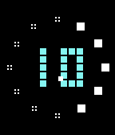
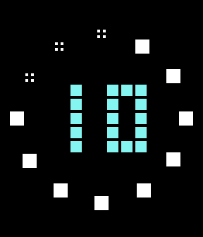

# Minute Blocks Store Listing

## Basic Info

- Title: Minute Blocks
- Developer: cmore
- Category: Faces
- Type: Watchface
- Version: 1.0.0
- Website URL: https://github.com/cmore-zz/pebble-minute-blocks
- Source code URL: https://github.com/cmore-zz/pebble-minute-blocks
- Support email: pebble@cmore.org

## Platforms

- OG Pebble
- Steel
- Time/Time Steel
- Time Round
- 2
- 2 Duo
- Time 2
- Round 2

The PBW currently targets `aplite`, `basalt`, `chalk`, `diorite`, `emery`, `flint`, and `gabbro`.

## Short Description

A blocky digital watchface with minute-by-minute geometry, pixel text, and configurable corner "complications" on rectangular Pebble watches, and centered complications on round Pebble watches (two on Pebble Time Round, four on the larger Pebble Round 2).

## Description

**Tell time in blocks: chunky pixel digits for the hour, ringed by twelve markers that fill in block by block as the minutes pass.**

Configurable corner complications show date, weather, battery, Bluetooth, or steps (centered on round watches). They stay visible or hide until you shake the watch, and every element's color is customizable. Weather comes from Open-Meteo via the phone's location — no API key needed.

Two optional extras, both off by default: a subtle seconds sweep, and a "Kinetic" mode that animates the blocks falling into place, smashing together when a marker completes, and cascading off the bottom at the top of the hour.

*Appstore note: real listings are short and visual — the bold line plus the first paragraph is enough for the description field. Everything below is reference detail.*

## Animations

Both features below are optional — enable them in the Pebble app settings.

A subtle seconds indicator can sweep the ring: set it to never show, reveal on a
wrist shake, or stay always on (always on affects battery life).

A "Kinetic" mode (off by default) adds playful motion to the blocks:
* a new block falls into place as each minute ticks (minutes 1–4 of every five)
* the four blocks stretch apart and then smash together as a five-minute marker completes
* all twelve blocks cascade off the bottom of the screen at the top of each hour





The animations run in short bursts rather than as a constant draw, so they stay
light on battery: with Kinetic on and seconds off, Battery+ estimated roughly two
weeks on a Pebble Time 2 (an estimate that varies by watch and use). Always-on
seconds has a greater effect on battery life.

## Additional Customization

Watch face element colors can be customized, and (as mentioned above) "complication" slots can be filled with any of the available sources. (Currently options include temperature, temperature forecast, date, steps, etc.)

## Privacy Notes

- Location is used only for weather lookup.
- Weather requests are sent to Open-Meteo from PebbleKit JS on the phone.
- Step counts are read from Pebble Health on the watch.
- Settings are stored locally by the Pebble app.

## Attribution

The [Visitor](https://www.dafont.com/visitor.font) font is a Freeware font by Aenigma (Brian Kent) and was downloaded from DaFont.

## Assets

### Screenshots

| Platform | Normal | Active complications | Event overlay | Active overlay |
| --- | --- | --- | --- | --- |
| OG Pebble / Steel / Pebble 2 (`aplite`) | [`aplite-normal.png`](screenshots/aplite-normal.png) | [`aplite-active.png`](screenshots/aplite-active.png) | [`aplite-overlay.png`](screenshots/aplite-overlay.png) | [`aplite-overlay-active.png`](screenshots/aplite-overlay-active.png) |
| Pebble Time / Time Steel (`basalt`) | [`basalt-normal.png`](screenshots/basalt-normal.png) | [`basalt-active.png`](screenshots/basalt-active.png) | [`basalt-overlay.png`](screenshots/basalt-overlay.png) | [`basalt-overlay-active.png`](screenshots/basalt-overlay-active.png) |
| Pebble Time Round (`chalk`) | [`chalk-normal.png`](screenshots/chalk-normal.png) | [`chalk-active.png`](screenshots/chalk-active.png) | - | - |
| Pebble Round 2 (`gabbro`) | [`gabbro-normal.png`](screenshots/gabbro-normal.png) | [`gabbro-active.png`](screenshots/gabbro-active.png) | - | - |
| Pebble 2 SE (`diorite`) | [`diorite-normal.png`](screenshots/diorite-normal.png) | [`diorite-active.png`](screenshots/diorite-active.png) | [`diorite-overlay.png`](screenshots/diorite-overlay.png) | [`diorite-overlay-active.png`](screenshots/diorite-overlay-active.png) |
| Pebble 2 Duo (`flint`, same render as `diorite`) | [`diorite-normal.png`](screenshots/diorite-normal.png) | [`diorite-active.png`](screenshots/diorite-active.png) | [`diorite-overlay.png`](screenshots/diorite-overlay.png) | [`diorite-overlay-active.png`](screenshots/diorite-overlay-active.png) |
| Pebble Time 2 (`emery`) | [`emery-normal.png`](screenshots/emery-normal.png) | [`emery-active.png`](screenshots/emery-active.png) | [`emery-overlay.png`](screenshots/emery-overlay.png) | [`emery-overlay-active.png`](screenshots/emery-overlay-active.png) |

Regenerate screenshots with:

```sh
just screenshots
```

The store accepts up to 5 screenshots per platform and supports **animated
GIFs** — real listings use them, so lead with one of the animation clips below
on the color platforms (basalt, chalk, emery, gabbro) to show the motion.

### Animation clips (usable as screenshots)

- [`animations/falling-block.gif`](animations/falling-block.gif) — a minute block falling into place
- [`animations/smash-and-cascade.gif`](animations/smash-and-cascade.gif) — marker smash + top-of-hour cascade

### Marketing banner

The publishing portal lists a marketing banner as a required upload (historical
spec: **720×320 px**). Not yet created — generate one before publishing (a wide
crop of the face on a color platform works). Confirm the exact requirement/size
against the template on the portal's Appstore Assets page.

### Icons

- Icon source crop: `store-assets/icons/minute-blocks-icon-source.png`
- Large list icon: `store-assets/icons/minute-blocks-list-144.png`
- Small list icon: `store-assets/icons/minute-blocks-list-80.png`
- PBW menu icon: `resources/images/menu_icon.png`

## Publish Checklist

- Upload `build/pebble-minute-blocks.pbw`.
- Upload at least one screenshot per supported platform collection (up to 5 each).
- Lead with an animation GIF (`animations/`) as a screenshot on the color platforms.
- Create and upload a marketing banner (720×320; confirm requirement on the portal).
- Upload large and small listing icons.
- Keep the description field short — the bold pitch plus one paragraph.
- Add website, source, and support links if available.
- Verify `private` visibility before publishing publicly.
- Increment `version` in `package.json` for each released PBW.
